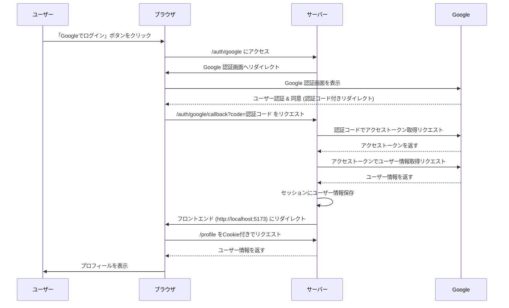

```mermaid
sequenceDiagram
    participant U as ユーザー
    participant B as ブラウザ
    participant S as サーバー
    participant G as Google

    U->>B: 「Googleでログイン」ボタンをクリック
    B->>S: /auth/google にアクセス
    S->>B: Google 認証画面へリダイレクト
    B->>G: Google 認証画面を表示
    G-->>B: ユーザー認証 & 同意 (認証コード付きリダイレクト)
    B->>S: /auth/google/callback?code=認証コード をリクエスト
    S->>G: 認証コードでアクセストークン取得リクエスト
    G-->>S: アクセストークンを返す
    S->>G: アクセストークンでユーザー情報取得リクエスト
    G-->>S: ユーザー情報を返す
    S->>S: セッションにユーザー情報保存
    S->>B: フロントエンド (http://localhost:5173) にリダイレクト
    B->>S: /profile をCookie付きでリクエスト
    S-->>B: ユーザー情報を返す
    B->>U: プロフィールを表示
```